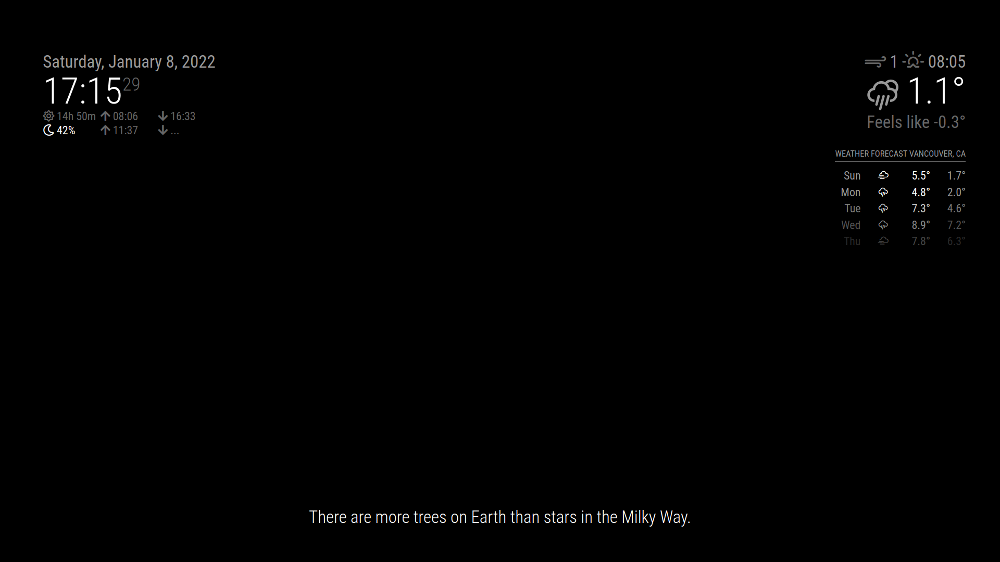

# MMM-Facts: Un módulo para MagicMirror

Muestra algunos datos curiosos. Hace que tu espejo parezca una pantalla de carga de un RPG. No se necesitan APIs.



## Instalación del módulo

Clona este repositorio en tu carpeta `~/MagicMirror/modules/`:

```bash
git clone https://github.com/alanshen111/MMM-Facts
```

## Uso del módulo

Agrega el módulo al archivo `~/MagicMirror/config/config.js`:

```javascript
modules: [
		{
			module: 'MMM-Facts',
			position: 'bottom_bar',
		}
]
```

También puedes agregar configuraciones:

```javascript
modules: [
		{
			module: 'MMM-Facts',
			position: 'bottom_bar',
			config: {
					updateInterval: 5,
					fadeSpeed: 4,
					category: 'random',
			}
		}
]
```

## Opciones de configuración

<table>
	<thead>
		<tr>
			<th>Opciones</th>
			<th>Descripción</th>
		</tr>
	</thead>
	<tbody>
		<tr>
			<td><code>updateInterval</code></td>
			<td>Tiempo en segundos que tarda en cambiar el dato.</td>
		</tr>
		<tr>
			<td><code>fadeSpeed</code></td>
			<td>Tiempo en segundos que tarda en desvanecerse el dato.</td>
		</tr>
		<tr>
			<td><code>category</code></td>
			<td>El predeterminado es <code>random</code>, pero puedes elegir categorías específicas como <code>art</code>, <code>food</code>, <code>health</code>, <code>history</code>, <code>language</code>, <code>nature</code>, <code>nerd</code>, <code>space</code> o <code>tips</code>. ¡No dudes en agregar las tuyas también!</td>
		</tr>
	</tbody>
</table>

## Cómo agregar tus propios datos

Puedes editar el archivo `MMM-Facts.js` si te sientes cómodo fusionándolo con cambios remotos.
Alternativamente, puedes bifurcar este repositorio para tener una copia exclusiva que puedas editar sin conflictos.
