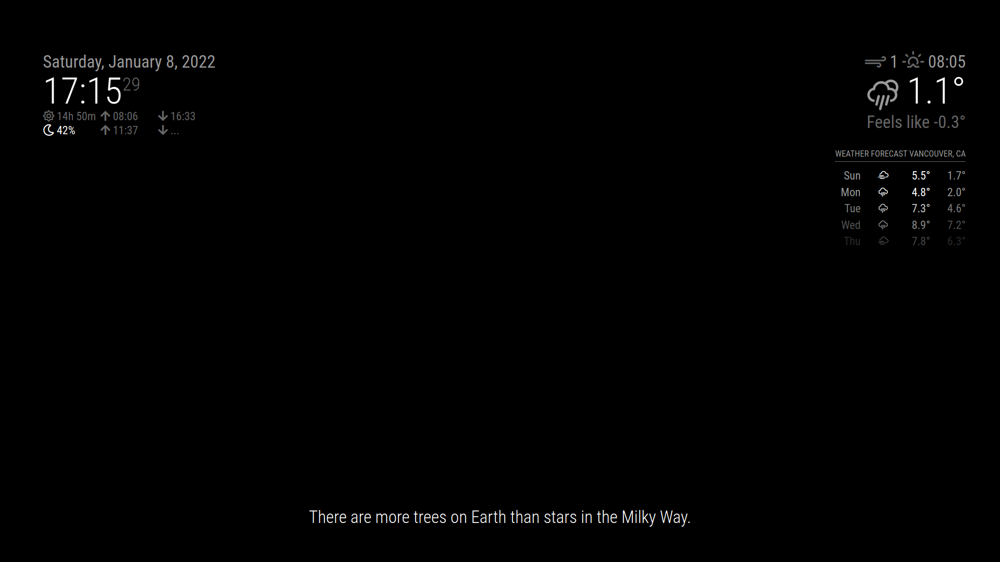

# Facts: A Magic Mirror Module

Displays some facts. Makes your mirror look like an RPG loading screen. No APIs needed. 



## Installing the module
Clone this repository in your `~/MagicMirror/modules/` folder
````javascript
git clone https://github.com/alanshen111/facts.git
````

## Using the module
Add the module to the `~/MagicMirror/config/config.js` file:
````javascript
modules: [
		{
			module: 'facts',
			position: 'bottom_bar',
			/**
			config: {
					updateInterval: 5,	
					fadeSpeed: 4,			
					category: 'random',	
			}
			**/
		}
]
````

## Configuration options

<table>
	<thead>
		<tr>
			<th>Options</th>
			<th>Description</th>
		</tr>
	</thead>
	<tbody>
		<tr>
			<td><code>updateInterval</code></td>
			<td>Time the fact is changed in seconds</td>
		</tr>
		<tr>
			<td><code>fadeSpeed</code></td>
			<td>Fact text fadeout in seconds.</td>
		</tr>
		<tr>
			<td><code>category</code></td>
			<td>Default is <code>random</code>, but you can choose specific categories such as <code>art</code>, <code>food</code>, <code>health</code>, <code>history</code>, <code>language</code>, <code>nature</code>, <code>nerd</code>, <code>space</code> or <code>tips</code>. Feel free to add your own as well! </td>
		</tr>
	</tbody>
</table>

## Adding facts
You can edit the `facts.js` file.

## Extra Credits
Inspired by the [random_quotes](https://github.com/KirAsh4/random_quotes) module.
